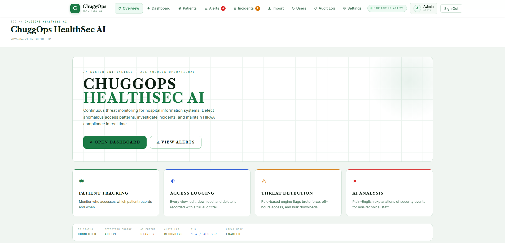
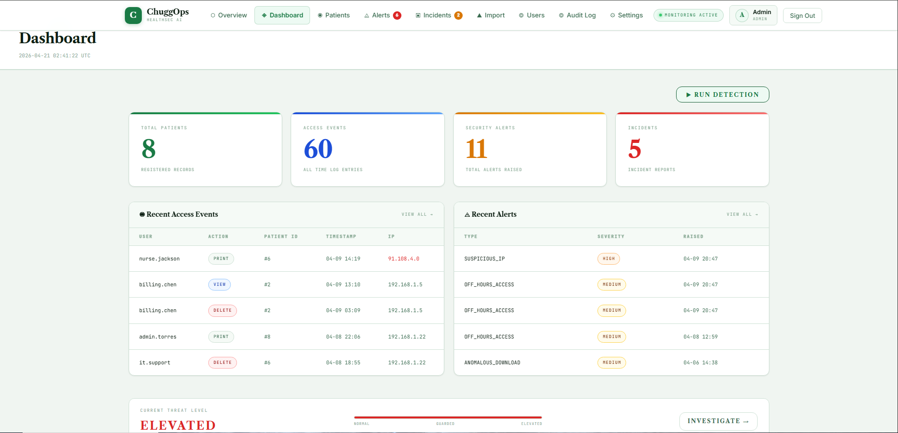
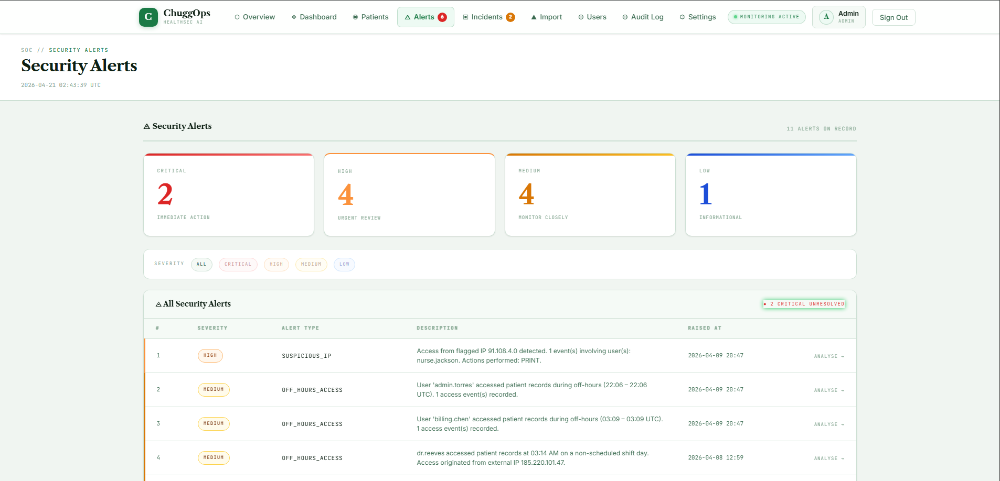
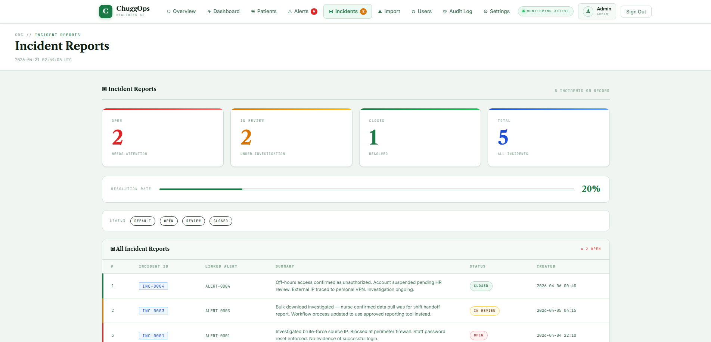
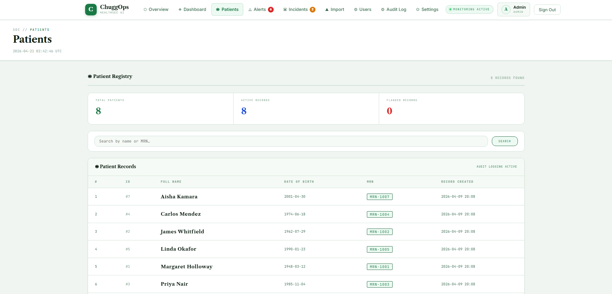
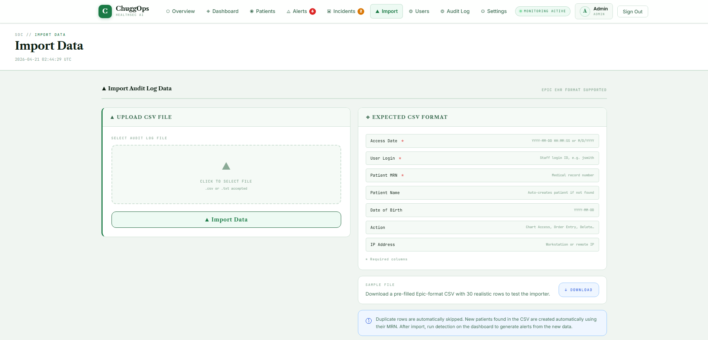
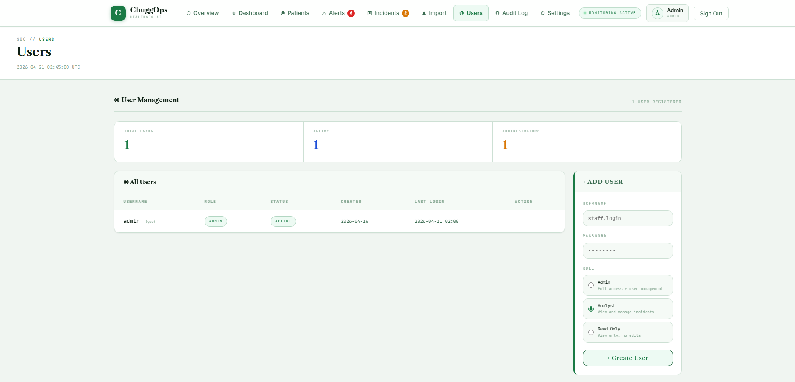

# ChuggOps HealthSec AI

A healthcare cybersecurity monitoring platform that detects suspicious EHR access in real time — built for hospital security and compliance teams.

---

## Screenshots















---

## What it does

Hospitals generate thousands of EHR access events every day. ChuggOps HealthSec AI continuously monitors that activity and flags anomalies automatically:

- **Rule-based detection** — catches known attack patterns (brute force, off-hours access, bulk record exports, privilege escalation, and more)
- **ML anomaly detection** — Isolation Forest model learns what normal access looks like and flags deviations, no labelled attack data required
- **Real-time dashboard** — Server-Sent Events push live alert and incident counts to the browser without polling
- **Incident management** — analysts can open, investigate, and close incidents with notes and status tracking
- **Configurable thresholds** — all detection parameters are adjustable from the settings UI without touching code
- **Email notifications** — HIGH and CRITICAL alerts trigger SMTP emails to on-call staff

---

## Tech stack

| Layer | Technology |
|---|---|
| Backend | FastAPI, SQLAlchemy, APScheduler |
| ML | scikit-learn (Isolation Forest), joblib |
| Database | PostgreSQL (prod) / SQLite (dev) |
| Frontend | Jinja2 templates, vanilla JS, SSE |
| Reverse proxy | Nginx (TLS 1.3, HIPAA security headers, rate limiting) |
| Containerisation | Docker, Docker Compose |

---

## Quick start (local dev)

**Requirements:** Python 3.11+

```bash
git clone https://github.com/charliepb19/ChuggOps-HealthSec-AI.git
cd ChuggOps-HealthSec-AI

python -m venv venv
source venv/bin/activate        # Windows: venv\Scripts\activate

pip install -r requirements.txt

cp .env.example .env            # fill in SESSION_SECRET at minimum

uvicorn app.main:app --reload
```

Open `http://localhost:8000` and log in with the credentials you set in `.env` (`CHUGGOPS_ADMIN_USER` / `CHUGGOPS_ADMIN_PASS`).

---

## Production deployment (Docker)

**Requirements:** Docker, Docker Compose, a domain name with DNS pointed at your server

```bash
cp .env.example .env
# Edit .env — set CHUGGOPS_ADMIN_PASS, SESSION_SECRET, DB_PASSWORD
# Place TLS certificates at ssl/cert.pem and ssl/key.pem

docker compose up -d
```

The stack starts three containers:

| Container | Role |
|---|---|
| `db` | PostgreSQL 16 |
| `app` | FastAPI + uvicorn (waits for DB health) |
| `nginx` | Reverse proxy — TLS termination, rate limiting, security headers |

The app is available on port 443. HTTP redirects to HTTPS automatically.

---

## Environment variables

See [.env.example](.env.example) for the full list with descriptions. Key variables:

| Variable | Required | Description |
|---|---|---|
| `CHUGGOPS_ADMIN_USER` | Yes | Admin username seeded on first startup |
| `CHUGGOPS_ADMIN_PASS` | Yes | Admin password — change before deploying |
| `SESSION_SECRET` | Yes | Random hex key for session signing |
| `DB_PASSWORD` | Docker only | PostgreSQL password |
| `OPENAI_API_KEY` | No | Enables GPT-powered alert analysis |
| `SMTP_HOST` / `SMTP_USER` / `SMTP_PASS` | No | Email notifications for HIGH/CRITICAL alerts |

---

## Detection rules

| Rule | What it catches |
|---|---|
| Brute force | Multiple failed logins from the same IP |
| Off-hours access | Logins outside business hours |
| Bulk record access | Unusually high number of records accessed in a short window |
| Privilege escalation | Role changes on user accounts |
| Sensitive record access | Access to VIP or restricted patient records |
| Bulk export | Large data exports in a short period |
| ML anomaly | Behavioural patterns that deviate from the trained baseline |

All thresholds are configurable from **Settings** in the UI.

---

## Project structure

```
app/
  main.py          # FastAPI app, routes, lifespan
  models.py        # SQLAlchemy ORM models
  detection.py     # Rule-based detection engine
  ml_detection.py  # Isolation Forest anomaly detection
  scheduler.py     # APScheduler jobs (detection every 15 min, ML retrain daily)
  auth.py          # Session-based authentication middleware
  ingestion.py     # CSV/JSON log ingestion
  notifications.py # Email alerting
  templates/       # Jinja2 HTML templates
  static/          # CSS and static assets
Dockerfile
docker-compose.yml
nginx.conf
entrypoint.sh
```

---

## License

MIT
